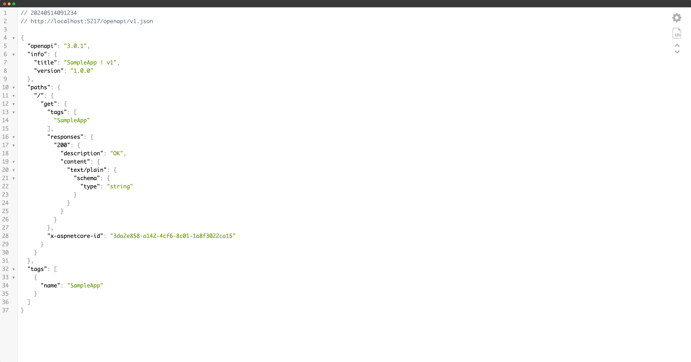
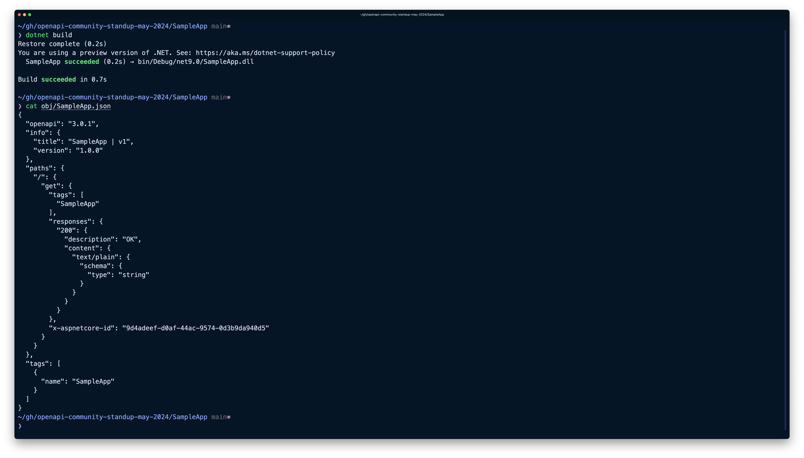
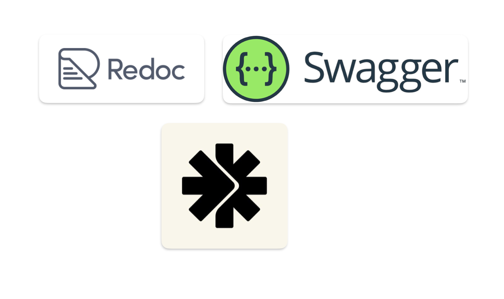

# Microsoft.AspNetCore.OpenApi in .NET 9

### ASP.NET Community Stand (May 28th, 2024)

---

## Agenda

- What is it?
- Configuration and customization
- Integration with 3rd party tools
- Implementation overview
- All about schemas
- Next steps

---

## What we don't do

- No client/server code generation
- No OpenAPI UI in-framework
- No OpenAPI-based spec testing

## What we _do_ do

- Code-first OpenAPI documentation generation
    - For both minimal and controller-based APIs
    - With support for certain customizations
    - And Native AoT (for minimal APIs)
---

## Getting started

```bash
$ dotnet new web
$ dotnet add package Microsoft.AspNetCore.OpenApi --prerelease
```

```csharp
var builder = WebApplication.CreateBuilder();

builder.Services.AddOpenApi(); // NEW!

var app = builder.Build();

app.MapOpenApi(); // NEW! 

app.MapGet("/", () => "Hello world!");

app.Run();
```

---



---


## Build-time document generation

```bash
$ dotnet add package Microsoft.Extensions.ApiDescription.Server --prerelease
```

---



---

## What about UI?

---



---

## Managing multiple docs in the same app

---

## Default inclusion predicate

```csharp
ShouldInclude = (description) => description.GroupName == null || description.GroupName == DocumentName;
```

---

**Microsoft.AspNetCore.Mvc.ApiExplorer.ApiDescription**
- Access to endpoint metadata
- Access to `MethodInfo` associated with handlers
- Access to route values/parameters

---

## Transformers for customizations

- Document transformers
- Operation transformers
- Run in FIFO order of registration

---

## Fundamental transformer function

(OpenApiDocument, OpenApiDocumentTransformerContext, CancellationToken) => Task
(OpenApiOperation, OpenApiOperationTransformerContext, CancellationToken) => Task

---

## OpenApiDocument/OpenApiOperation

- Types from Microsoft.OpenApi library
- Mutable

---

## OpenApiDocumentTransformerContext/OpenApiOperationTransformerContext

- DocumentName
- IReadOnlyList<ApiDescriptionGroup>/ApiDescription
- IServiceProvider

---

## Transformer registration APIs

- Transformers are registered on `OpenApiOptions` associated with each document
- Registration APIs
    - Instance-based (document transformers only)
    - Delegate-based (document and operation transformers)
    - Activated (document transformers only)

---

## What versions of the OpenAPI spec are supported?

- OpenApi v2 (aka Swagger)
- OpenApi v3

---

## What about Microsoft.AspNetCore.OpenAPI < v8.0?

```csharp
app.MapGet("/", () => "Hello world!")
    .WithOpenApi();
```

---

## Architecture Overview 

--- 

## Let's talk about JSON Schema

- OpenAPI schema vs. JSON schema
- JSON schema support coming to System.Text.Json
- System.Text.Json -> JsonObject -> OpenApiJsonSchema -> OpenApiSchema

---

## Route constraints + validation attributes

---

## Enums

---

## Forms

---

## Polymorphic types

---

## Future

- Schemas refs support
- Schema transformers support
- XML doc comment support
- Ecosystem integrations (`Asp.Versioning`)
- Evolving with OpenAPI (v4)
- Improving build-time generation experience

---