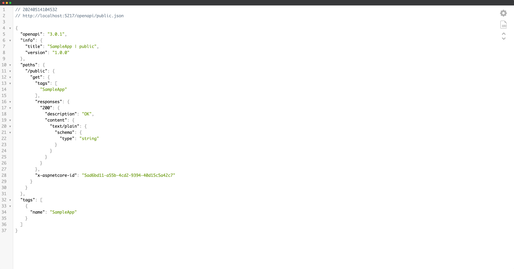

# Microsoft.AspNetCore.OpenApi in .NET 9

### ASP.NET Community Stand (May 28th, 2024)

---

## Agenda

- What is it?
- Configuration and customization
- All about schemas
- Integration with 3rd party tools
- Implementation overview
- Next steps

---

## What we don't do

- No client/server code generation
- No OpenAPI UI in-framework
- No OpenAPI-based 

## What we _do_ do

- Code-first OpenAPI documentation generation
    - For both minimal and controller-based APIs

---

## Getting started

```bash
$ dotnet new web
$ dotnet add package Microsoft.AspNetCore.OpenApi --prerelease
```

```csharp
var builder = WebApplication.CreateBuilder();

builder.Services.AddOpenApi(); // NEW!

var app = builder.Build();

app.MapOpenApi(); // NEW! 

app.MapGet("/", () => "Hello world!");

app.Run();
```

---


---


## Build-time document generation

```bash
$ dotnet add package Microsoft.Extensions.ApiDescription.Server --prerelease
```

---


---

## Managing multiple docs in the same app

---


---



---

## Default inclusion predicate

```csharp
ShouldInclude = (description) => description.GroupName == null || description.GroupName == DocumentName;
```

---

## Let's talk about JSON Schema

---

## Architecture Overview 

--- 